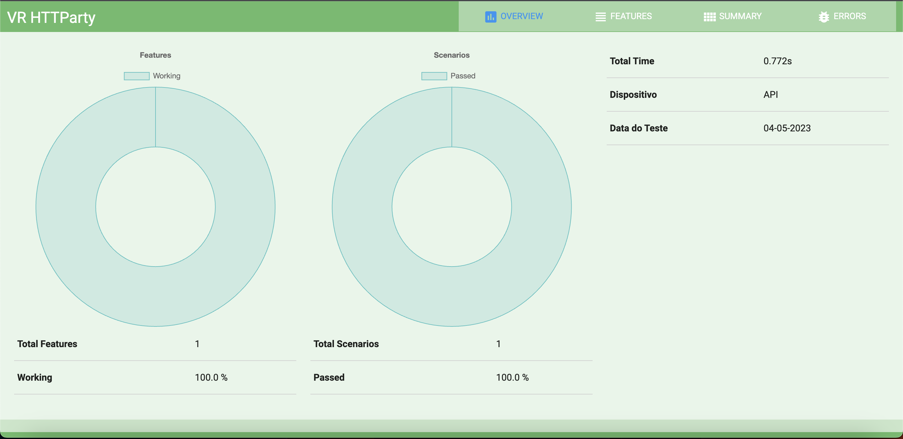
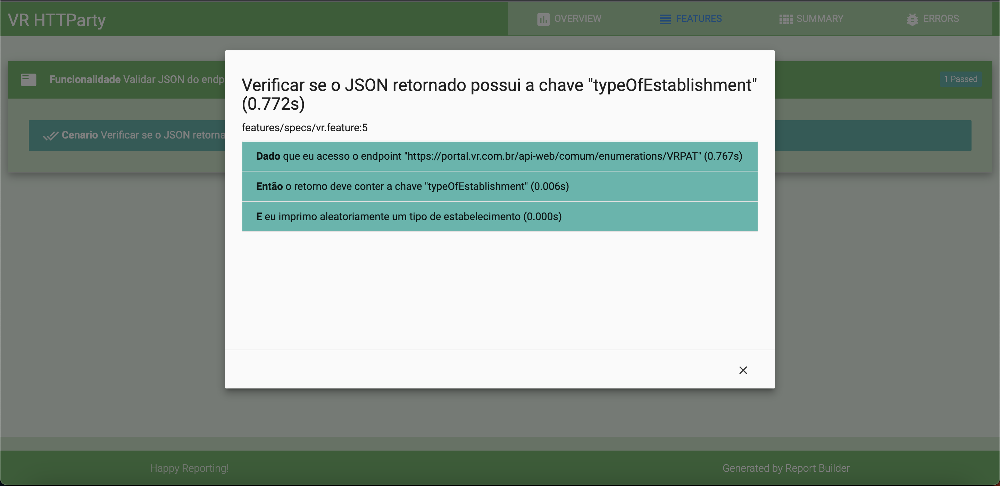

# VR-HTTParty

Automação da API VRPAT

## Direções

1. Faça o download da última versão estável e instale o Ruby na máquina: `https://rubyinstaller.org/downloads/`
2. Instale o bundler: `gem install bundler`
3. Clone o projeto em uma pasta do PC/Notebook de sua preferência: `git clone https://github.com/TiagoPereiraCruz/vr-httparty`
4. Navegue até o diretório do projeto
5. Execute o comando no terminal: `bundle install`
6. Execute o comando no terminal: `cucumber` (no windows) ou `bundle exec cucumber`(no linux/Mac)

## Cereja

[Report] Resultados podem ser encontrados em: vr-httparty\log -> report_dd-mm-YYYY.html

[contato] tiago.peng@gmail.com

